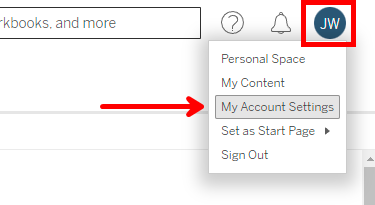
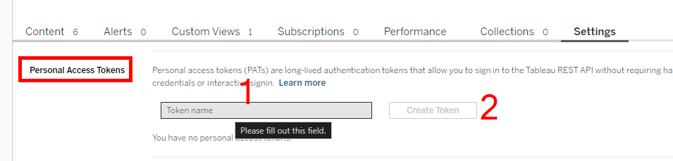
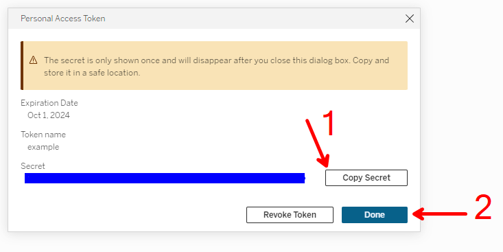
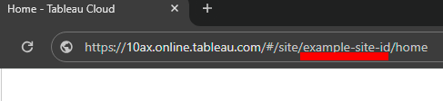

# Download data from a view by name

<!--toc:start-->
 - [Installation](#installation)
 - [Authentication](#authentication)
   - [Create a Personal Access Token](#create-a-personal-access-token)
   - [Using the Personal Access Token](#using-the-personal-access-token)
 - [Finding the View](#finding-the-view)
 - [Downloading the Data](#downloading-the-data)
 - [Conclusion](#conclusion)
<!--toc:end-->


A question arose recently on the [Tableau DataDev slack](https://tabsoft.co/JoinTableauDev)
about how to download data from a view when you have the name of the view. This
is such a common need and its worth exploring how to do this and what the common
traps might be.

For this example, we are going to use the Tableau Server Client (TSC) library.

[Tableau Server Client Documentation](https://tableau.github.io/server-client-python/docs/)

## Installation

```bash
pip install "tableauserverclient>=0.30"
```

## Authentication

Connecting to Tableau Server with the REST API has a few options. Username and 
password is what you might expect to use, but certain Server configurations can
make that difficult. If the Server is configured for Single Sign On (SSO) or 
Multi Factor Authentication (MFA) then username and password will not work. I 
suggest creating a Personal Access Token (PAT) for signing in. 

### Create a Personal Access Token

First, go to your account settings.



Then, create a new Personal Access Token. The server requires you enter a name
to be able to create the token. Be sure to copy your secret key out before 
closing the dialog. You will not be able to see it again.







### Using the Personal Access Token

Now that you have your token name and secret, you will need to use them to
login to the server. I have found using ".env" files to be a good way to keep
secrets out of the code. Here is an example ".env" file that you can use to
store your PAT.

```plaintext
# .env

# Tableau Server
TABLEAU_SERVER=https://10az.online.tableau.com
TABLEAU_PAT_NAME=your-pat-name
TABLEAU_PAT_SECRET=your-pat-secret
```

These secrets can be loaded into your code using the `dotenv` package. Here is
how to install the dotenv package for python.

```bash
pip install python-dotenv
```

Now, we can read in the secrets and use them to login to the server.

```python
import os 

from dotenv import load_dotenv
import tableauserverclient as TSC

load_dotenv()

server = TSC.Server(os.getenv("TABLEAU_SERVER"), True)
auth = TSC.PersonalAccessTokenAuth(
    token_name=os.getenv("TABLEAU_PAT_NAME"),
    personal_access_token=os.getenv("TABLEAU_PAT_SECRET"),
    # For site_id, use the site content URL, not the site's LUID. See
    # the example screenshot below.
    site_id="example-site-id"
)

with server.auth.sign_in(auth):
    ...
```





## Finding the View

To download data from a view, you will need to know the view's ID. If you
already know the view's ID, you can get the view object really easily!

```python
view_id = "your-view-id"
view = server.views.get_by_id(view_id)
```

But if you only know the view's name, you will need to search for the view.
Keep in mind that view names are only unique within a Workbook, Workbook names
are only unique within a Project, and Project names are only unique within a
parent project. The more specific you can be with your search, the better.

We are going to use the [Django style filters](https://tableau.github.io/server-client-python/docs/filter-sort#django-style-filters-and-sorts)
to search for the view by name, because it is the shortest and most readable
way to do it. See [View filter list](https://help.tableau.com/current/api/rest_api/en-us/REST/rest_api_concepts_filtering_and_sorting.htm#views)
for a list of all the filters you can use.

```python

# Find the view by name
view_name = "your-view-name"
views = server.views.filter(name=view_name)

# If you know the workbook name, or project name, you can filter by those too
workbook_name = "your-workbook-name"
project_name = "your-project-name"
views = server.views.filter(
    name=view_name,
    workbook_name=workbook_name,
    project_name=project_name,
)
```

`views` is now an iterator object that you can loop over. If you are confident
that there is only one view with that name, you can get the first view from the
iterator. But if you are not sure can check how many views were returned.

```python

if len(views) == 0:
    raise ValueError("No views found with that name")
elif len(views) > 1:
    raise ValueError("More than one view found with that name")
```

## Downloading the Data

Now that you have the view object, you can download the data. The view object
will need to have its csv property populated. When doing so, you may also
want to apply filters to the view to get only the data you want. When targeting
a dashboard, be aware that only the first sheet in the dashboard is accessible.

```python
# Construct the filter
csv_options = TSC.CSVRequestOptions()
# the .vf method is how you apply view filters to the data being
# downloaded. The first argument is the field name, and the second
# argument is the value you want to filter by. You are even able to filter
# by values not in the original sheet.
csv_options.vf('Region', 'West')
csv_options.vf('Category', 'Furniture')

# loop over the views
for view in views:
    view: TSC.ViewItem
    server.views.populate_csv(view, csv_options)
    with open(f"{view.name}.csv", "w") as f:
        for chunk in view.csv:
            f.write(chunk)
```

The `view.csv` property is a generator that will yield the data in chunks. You
can write these chunks to a file or process them in memory. The data is in CSV
format, so you may want to use the `csv` module to parse the output.


## Conclusion

Downloading data from a view by name is a common need. The Tableau Server Client
library makes this easy to do. You can use the Django style filters to search
for the view by name, and then download the data using the `populate_csv` method.
Remember that view names are only unique within a workbook, so you may need to
filter by workbook name, project name, or tag to get the correct view.

Putting it all together, here is the complete code.


```plaintext
# .env

# Tableau Server
TABLEAU_SERVER=https://10az.online.tableau.com
TABLEAU_PAT_NAME=your-pat-name
TABLEAU_PAT_SECRET=your-pat-secret
```

```python
# /// script
# requires-python: >=3.8
# dependencies = [
#   "tableauserverclient>=0.30",
#   "python-dotenv",
# ]
# ///

import os 

from dotenv import load_dotenv
import tableauserverclient as TSC

load_dotenv()

server = TSC.Server(os.getenv("TABLEAU_SERVER"), True)
auth = TSC.PersonalAccessTokenAuth(
    token_name=os.getenv("TABLEAU_PAT_NAME"),
    personal_access_token=os.getenv("TABLEAU_PAT_SECRET"),
    site_id="example-site-id"
)

with server.auth.sign_in(auth):
# Find the view by name
    view_name = "your-view-name"
    workbook_name = "your-workbook-name"
    project_name = "your-project-name"
    views = server.views.filter(
        name=view_name,
        workbook_name=workbook_name,
        project_name=project_name,
    )

    if len(views) == 0:
        raise ValueError("No views found with that name")
    elif len(views) > 1:
        raise ValueError("More than one view found with that name")

    csv_options = TSC.CSVRequestOptions()
    csv_options.vf('Region', 'West')
    csv_options.vf('Category', 'Furniture')

# loop over the views
    for view in views:
        view: TSC.ViewItem
        server.views.populate_csv(view, csv_options)
        with open(f"{view.name}.csv", "w") as f:
            for chunk in view.csv:
                f.write(chunk)
```

